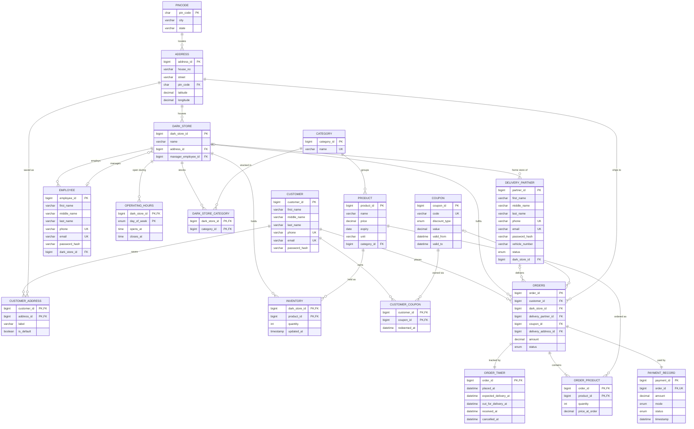

# ER Diagram — relational schema (after normalization)

This is `schema.sql` drawn as a diagram. It renders on GitHub and in VS Code's Markdown
preview. The hand-drawn conceptual ERD is still in `ERD.png`.

**What's new compared to `ERD.png`:**
- **Order_Timer**, a weak entity tied to Order by the 1:1 identifying relationship *Tracked By*
- latitude/longitude on Address
- login columns on Employee and Delivery_Partner

## Updating `ERD.png`: the Order_Timer entity

To bring the hand-drawn Chen-notation diagram up to date:

1. Draw **Order_Timer** as a *weak entity* (double rectangle) next to **Order**.
2. Connect them with an *identifying relationship* (double diamond) called
   **Tracked By**: Order **1** to Order_Timer **1**. Order_Timer's side has total
   participation (double line).
3. Give Order_Timer these attributes: `placed_at`, `expected_delivery_at`,
   `out_for_delivery_at`, `received_at`, `cancelled_at`. It has no key of its own,
   because it is identified through Order.
4. Remove `date time` from Order; `placed_at` replaces it.
5. Add `latitude` and `longitude` to Address.
